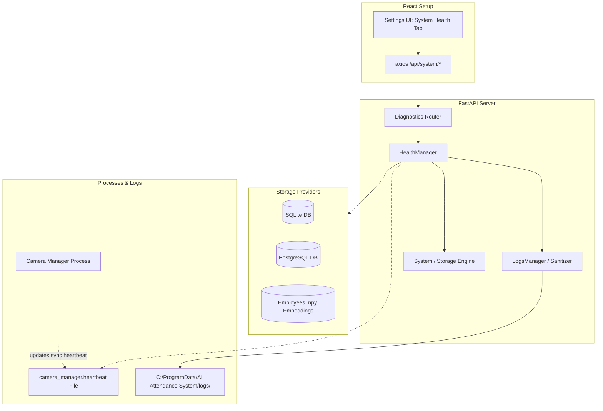

# Production Diagnostics & System Health (Phase D0)

This document describes the system health and diagnostics layer designed for the AI Attendance Management System. This layer allows non-technical administrators to monitor, diagnose, and troubleshoot production issues directly from the frontend UI Settings page, without opening terminals or accessing the backend logs file system directly.

---

## 1. System Architecture

The diagnostics architecture is self-contained, runs entirely locally, and does not transmit data externally.



---

## 2. Health Checks Details

All diagnostic checks are managed by the `HealthManager` and exposed through `GET /api/system/health`.

### Application Health
- **Uptime**: Tracks the elapsed running time of the FastAPI server.
- **Version**: Exposes the installed application release (default: `1.0.0`).

### Database Health
- **Connection**: Checks database connectivity by executing a quick query (`SELECT 1`).
- **Latency**: Measures the connection response time in milliseconds.
- **Provider**: Identifies whether `SQLITE`, `LOCAL_POSTGRES`, or `EXTERNAL_POSTGRES` is active.
- **Migration Status**: Programmatically compares the database's current Alembic revision hash against the head migration script to determine if schema upgrades are pending (`UP_TO_DATE` or `MIGRATION_REQUIRED`).
- **Database Size**: Exposes database file size (reads file size for SQLite; queries `pg_database_size()` for PostgreSQL).

### Camera System Health
- **Total Cameras**: Number of configured (non-disabled) camera streams in the database.
- **Feeds Breakdown**: Breakdown of camera feeds currently `ONLINE`, `OFFLINE`, or in `ERROR` status.
- **Camera Manager Daemon**: Monitors the Camera Manager daemon's heartbeat file (`camera_manager.heartbeat`).
  - *Heuristic*: If total cameras > 0 and the manager heartbeat has expired (>60s), the Camera Engine is marked as stopped, triggering a system-wide `ERROR`. If no cameras are configured, the status remains `HEALTHY` even if the daemon is stopped.
- **Last Feed Action**: Latest heartbeat received from any active camera worker thread.

### System Storage Health
- **Storage Metrics**: Reads partition size, used space, and free space on the drive hosting the application data directory. Shows percentage used via a visual progress bar.

### System Backups
- **Last Run**: Date of the latest generated backup archive.
- **Backup Count**: Total backups present in the backups folder.
- **Automatic Backups**: Indicates whether automated cron backups are configured.
- **Status Check**: Compares the frequency interval (daily, weekly, monthly) against the last successful backup timestamp. Triggers a `OVERDUE` warning if backups are delayed.

### AI Recognition Engine
- **Acceleration Device**: Indicates whether CPU or GPU/CUDA acceleration is used for face detection.
- **Model Availability**: Validates whether local face detection and recognition libraries (`facenet-pytorch`, `torch`) are correctly installed and loaded.
- **Enrolled Faces**: Total number of custom numpy (`.npy`) face embedding files enrolled in the system.

---

## 3. Log Rotation

The system writes rotating log files inside the application data directory.

- **Windows path**: `C:\ProgramData\AI Attendance System\logs\`
- **Development fallback**: `<project_root>/data/logs/`

| Log File | Component | Manager |
|---|---|---|
| `backend.log` | FastAPI Server, Uvicorn, Database queries | `backend.diagnostics.logs` |
| `camera_manager.log` | Thread syncs, worker status updates | `backend.diagnostics.logs` |
| `electron.log` | Desktop shell setup, process stdout/stderr | Node `logMessage` function |

### Rotation Rules
- **Maximum Size**: 10 MB per file.
- **Backup Files**: 5 archived logs are kept (e.g. `backend.log.1` to `backend.log.5`). When the size limit is exceeded, logs roll over and the oldest file is deleted.

---

## 4. Diagnostics Zip Export

Administrators (restricted to **SUPER_ADMIN**) can request a troubleshooting archive via `POST /api/system/export-diagnostics`.

### Export Structure
```text
diagnostics_YYYY_MM_DD.zip/
├── health_report.json
├── system_info.json
└── logs/
    ├── backend.log
    ├── camera_manager.log
    └── electron.log
```

### Security & Sanitization
During zip packaging, files are sanitized line-by-line using regular expressions to mask credentials. The exported zip **never** contains raw:
- Database tables or connection passwords
- Employee images or face embedding values
- Authorization headers (`Bearer ...`)
- Security tokens, secret keys, or connection parameters (masked as `******` inside connection strings)

---

## 5. Security & RBAC Enforcements

| Endpoint | Action | Allowed Roles |
|---|---|---|
| `GET /api/system/health` | Read health state cards | `ADMIN`, `SUPER_ADMIN` |
| `GET /api/system/logs` | List available logs | `SUPER_ADMIN` |
| `GET /api/system/logs/{name}` | Fetch recent log tail | `SUPER_ADMIN` |
| `POST /api/system/export-diagnostics` | Download troubleshooting package | `SUPER_ADMIN` |

---

## 6. Troubleshooting Workflows

When an administrator notices an issue in the panel, they can troubleshoot using this checklist:

### Scenario A: Database is disconnected (`🔴 Critical` status)
1. Check the **Database Diagnostics** card for latency or connectivity state.
2. If `Disconnected`, check the database credentials in **Settings -> Database** or ensure the local/external PostgreSQL service is active.
3. If migrations show `Migration Required`, trigger a database update or check application launch logs in `backend.log` for Alembic upgrade tracebacks.

### Scenario B: Camera is offline / manager stopped (`🟡 Warning` or `🔴 Critical`)
1. If the manager is `Stopped` but feeds > 0:
   - Ensure python virtual environment is initialized.
   - Read `electron.log` to see if `face_service.camera_manager` failed with startup errors (e.g. missing torch or DLL bindings).
2. If a camera status is `ERROR`:
   - Inspect `camera_manager.log` to identify if it is a USB camera connection error or an invalid RTSP URL.

### Scenario C: Backups are overdue (`🟡 Warning`)
1. Verify backup location write permissions.
2. If automatic backups are enabled, ensure the scheduled time (e.g., `02:00`) falls when the host machine is awake and the application is running.
3. Check `backend.log` and look for logs with `[SCHEDULER]` prefix to inspect failure tracebacks.
